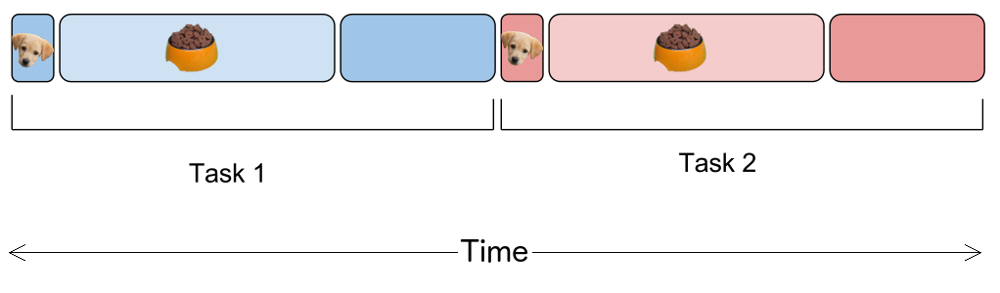
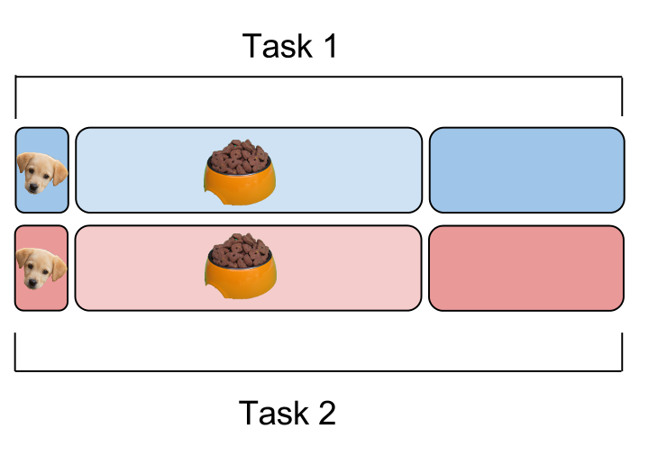

:title: Monitoring Async Apps
:author: Amy Boyle
:description: Why and how to measure asynchronous applications
:css: async.css

.. :data-transition-duration: 500

---------------------------------------------------------------

:id: title

:data-scale: 1

Monitoring Asynchronous Applications
====================================

Amy Boyle `@amylouboyle`__
***************************

.. note::
    words words words

__ https://twitter.com/amylouboyle

----------------------------------------------------------------

:data-x: r500
:data-y: r1200
:data-z: r-500

Roadmap

* Who am I and why?
* What and why async?
* Monitoring
* How to measure Async
* General solution

----------------------------------------------------------------

.. image:: img/whoami_transition.png

.. Software Engineer @

.. .. image:: img/NewRelic-logo-square.png
..     :height: 200px
..     :width: 200px

----------------------------------------------------------------

.. image:: img/async_transition.png

----------------------------------------------------------------

:id: paradigm-overview

* Synchronous

.. image:: img/sync_diagram.png

* Concurrent
    * Asynchronous

        .. image:: img/async_diagram.png

    * Parallel

        .. image:: img/parallel_diagram.png

----------------------------------------------------------------

.. image:: img/spilled_food.jpg
    :height: 500px
    :width: 500px

.. note::

    .. image:: https://c2.staticflickr.com/8/7391/12573558665_c06f2355ab.jpg

    A talk about async wouldn't be complete without an analogy

    Let's say you have you have a litter of puppies. Each puppy needs to be fed and cuddled.

    If you were to do this in a totally synchronous fashion, you would give a puppy its food, stand there and wait for her to finish, then clean up. Then you'd do that for the next puppy and the next etc.
    Then you would pick up and cuddle each puppy in turn as well.

    Parallel is if you had friends that could feed and cuddle the puppies, one each, all at the same time.

    Asynchronous fashion would allow you to give a puppy her food, and while she is eating you can move on to another puppy and give her her food. Since cuddling is an active task you can can't do anything else while you cuddle a puppy.

----------------------------------------------------------------

Synchronous
***********

----------------------------------------------------------------

Asynchronous
************

.. image:: img/async_puppy_diagram.png

----------------------------------------------------------------

Parallel
***********

----------------------------------------------------------------

.. role:: strike
    :class: strike

Examples will be in :strike:`Pseudocode` Python

.. image:: img/tornado.png

----------------------------------------------------------------

:id: ex-fetch1

Asynchronous code *yields* execution to other pieces of code

.. code:: python

    class SyncRequestHandler(RequestHandler):
        def get(self):
            client = HTTPClient()
            response = client.fetch(URL)
            self.finish('Pup is full!\n')

    class ASyncRequestHandler(RequestHandler):
        async def get(self):
            client = AsyncHTTPClient()
            responses = await client.fetch(URL)
            self.finish('Pup is full!\n')

----------------------------------------------------------------

:id: ex-fetch2

Asynchronous code *yields* execution to other pieces of code

.. code:: python

    class SyncRequestHandler(RequestHandler):
        def get(self):
            client = HTTPClient()
            for i in range(10):
                client.fetch(URL)
            self.finish('Pup is full!\n')

    class ASyncRequestHandler(RequestHandler):
        async def get(self):
            client = AsyncHTTPClient()
            futures = [client.fetch(URL) for i in range(10)]
            responses = await futures
            self.finish('Pup is full!\n')

----------------------------------------------------------------

Winning!
**********

* Wait on all I/O at the same time
* Other code can use the CPU while I/O is executing
* Do work after response is sent back
* No thread messiness

.. note::
    This supports multiple long-lived connections to a user

    Most common manifestation is event loops

----------------------------------------------------------------

.. image:: img/monitor_transition.png

----------------------------------------------------------------

Collecting and processing data about your application as it is running
***********************************************************************

----------------------------------------------------------------

Not Profiling
*************

.. note::
    * high overhead
    * gives you averages
    * doesn't give context

----------------------------------------------------------------

* Execution times for: handlers, queries, layers of stack
* Throughput
* Error rate

.. note::
    Monitoring is a VERY large topic, not covering most of it here

----------------------------------------------------------------

Your users should not be your monitoring system

.. note::
    If your app is broken you're losing money/sleep

----------------------------------------------------------------

<Something pithy about monitoring>

.. note::
    I'm going to focus on what is specific to asynchronous apps

    Performance matters. Slow websites erode your sanity.

    Why is my website slow? hint: it's the database

----------------------------------------------------------------

----------------------------------------------------------------

:id: example-app

Our example app

.. code:: python

    def cuddle(responses):
        # pretend to do processing
        time.sleep(0.01)

    class ASyncRequestHandler(RequestHandler):

        async def get(self):
            future = feed_puppy()
            await future
            self.finish('Pup is full!\n')
            cuddle()

    app = Application([('/', ASyncRequestHandler))]

    if __name__ == '__main__':
        app.listen(8888)
        tornado.ioloop.IOLoop.current().start()

----------------------------------------------------------------

What to Measure

* Response time
* Duration
* CPU time
* External time

----------------------------------------------------------------

----------------------------------------------------------------

Response Time

.. code-block:: python

    class ASyncRequestHandler(RequestHandler):

        async def get(self):
            start = time.time()
            future = feed_puppy()
            await future
            self.finish('Pup is full!\n')
            response_sent = time.time()
            cuddle()
            response_time = response_sent - start

----------------------------------------------------------------

.. image:: img/duration_diagram.png

----------------------------------------------------------------

Duration

.. code:: python

    class ASyncRequestHandler(RequestHandler):

        async def get(self):
            start = time.time()
            future = feed_puppy()
            await future
            self.finish('Pup is full!\n')
            cuddle()
            end = time.time()
            duration = end - start

----------------------------------------------------------------

.. image:: img/cputime_diagram.png

----------------------------------------------------------------

CPU time

.. code:: python

    class ASyncRequestHandler(RequestHandler):

        async def get(self):
            start = time.time()
            future = feed_puppy()
            check0 = time.time()
            await future
            check1 = time.time()
            self.finish('Pup is full!\n')
            cuddle()
            end = time.time()
            self_time = (check0 - start) + (end - check1)

----------------------------------------------------------------

.. image:: img/external_time_diagram.png

----------------------------------------------------------------

External Time

.. code:: python

    class ASyncRequestHandler(RequestHandler):

        def puppy_done_eating(self, future):
            self.meal_done_time = time.time()

        async def get(self):
            future = feed_puppy()
            future.add_done_callback(self.puppy_done_eating)
            check0 = time.time()
            await future
            self.finish('Pup is full!\n')
            cuddle()
            service_time = self.meal_done_time - check0

----------------------------------------------------------------

.. image:: img/blocking_time_diagram.png

----------------------------------------------------------------

Aggregate and collect data in monitor service

----------------------------------------------------------------

Percentiles are better than the mean

.. code:: python

    times.sort()
    index95 = int(len(times)*0.95)
    data_point = times[index95]

.. note::
    If your webservice has a mean latency of 100ms, your top 1% of requests may take 5 seconds. This is a bad user experience on it's own if that is a stand-alone service. However, if several such services are needed to render a page, the 99th percentile of one backend may become the median response overall of the frontend.

----------------------------------------------------------------

To the demo!

----------------------------------------------------------------

CPU intensive tasks are bad news for async architecture

.. image:: img/blocking_diagram.png

----------------------------------------------------------------

.. image:: img/general_solution_transition.png

----------------------------------------------------------------

**Strategies for a general solution**

* Bake it in
* Monkey patch code base
* Black box

----------------------------------------------------------------

Challenge of a general solution:

**Keeping track of callbacks**

.. code:: python

    class ASyncRequestHandler2(RequestHandler):

        def get(self):
            feed_puppy2(callback=cuddle_pup)

----------------------------------------------------------------

.. code:: python

    class ASyncRequestHandler2(RequestHandler):

        def cuddle_pup_wrapper(*args, **kwargs):
            start = time.time()
            cuddle_pup()
            self.cuddle_time = time.time() - start

        def get(self):
            feed_puppy2(callback=self.cuddle_pup_wrapper)

----------------------------------------------------------------

#. Create an object to hold metrics
#. Pass it around via wrapper code
#. Have condition for when done

----------------------------------------------------------------

:id: link-callbacks

.. code:: python

    class Metrics():
        def __init__(self, *args):
            self.data = {key:0 for key in args}
            self.ref_count = 0

        def done():
            # process and send data...

    def wrap(func, metrics, key):
        metrics.ref_count += 1
        def timed(*args, **kwargs):
            start = time.time()
            func(*args, **kwargs)
            metrics[key] += time.time() - start
            metrics.ref_count -= 1
            metrics.process_if_done()

        return timed

    class ASyncRequestHandler2(RequestHandler):
        def get(self):
            start = time.time()
            metrics = Metrics('cpu')
            feed_puppy2(callback=wrap(cuddle_pup, metrics, 'cpu'))
            metrics['cpu'] += time.time() - start

----------------------------------------------------------------

Use tools to help you
*********************

----------------------------------------------------------------

* Figure out what to measure: Response, Duration, CPU, Blocking
* Link the pieces together
* Visualize the data

----------------------------------------------------------------

Slides/Source on Github: `boylea/monitoring_async`__

__ https://github.com/boylea

`@amylouboyle`__

__ https://twitter.com/amylouboyle
