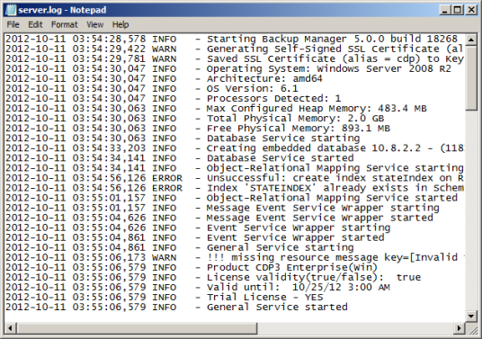
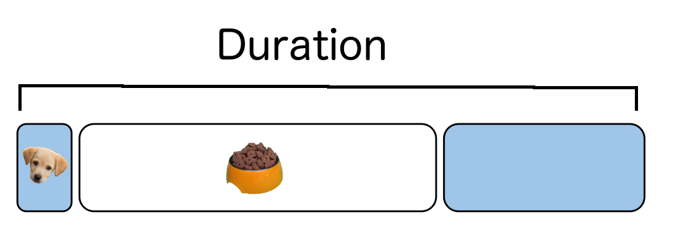
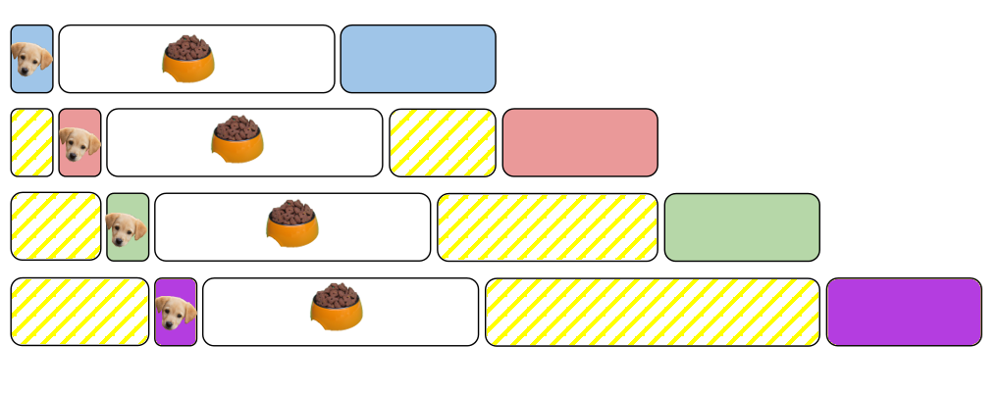

:title: Monitoring Async Apps
:author: Amy Boyle
:description: Why and how to measure asynchronous applications
:css: async.css

.. :data-transition-duration: 500

---------------------------------------------------------------

:id: title

:data-scale: 1

Monitoring Asynchronous Applications
====================================

Amy Boyle `@amylouboyle`__
***************************

.. note::
    background from subtlepatterns.com

__ https://twitter.com/amylouboyle

.. note::
    Async == Asynchronous

----------------------------------------------------------------

:data-x: r500
:data-y: r1200
:data-z: r-500

Roadmap

* Who am I and why?
* What and why async?
* Monitoring
* How to measure Async
* General solution

----------------------------------------------------------------

.. image:: img/whoami_transition.png

.. note::

    German Shepherd puppy: https://www.flickr.com/photos/jn2race/263170635

----------------------------------------------------------------

**Software Engineer @**

.. image:: img/NewRelic-logo-square.png
    :height: 200px
    :width: 200px

.. note::
     I am a software engineer at New Relic. New Relic provides multiple products for application monitoring, most notably APM. Recently I was working on gathering Async performance metrics for Python. This turned out to be a non-trivial task, so I thought I'd write a talk to share with y'all some of the things I learned.

----------------------------------------------------------------

.. image:: img/async_transition.png

.. note::
    There is some confusion on the internet as to what the terms surrounding concurrency mean. So I'm going to define them for you, and provide an explanation to serve as a framework for understanding the rest of this talk.

----------------------------------------------------------------

:id: paradigm-overview

* Synchronous

.. image:: img/sync_diagram.png

* Concurrent
    * Asynchronous

        .. image:: img/async_diagram.png

    * Parallel

        .. image:: img/parallel_diagram.png

.. note::
    Synchronous paradigm is the traditional way of doing things. Only executing on one task at a time, one after the other.

    A concurrent program is one that is able to work on multiple tasks in the same period of time.

    Asynchronous is interleaved task execute. We can alternately run chunks of different tasks.

    Parallel execution mean running different tasks in the same instant of time. For this we must have multiple CPU cores.

----------------------------------------------------------------

.. image:: img/meli_pup_cuddle.jpg
    :height: 500px
    :width: 500px

.. note::

    A talk about async wouldn't be complete without an analogy

    Let's say you have you have a litter of puppies. Each puppy needs to be fed and cuddled.

    If you were to do this in a totally synchronous fashion, you would give a puppy its food, stand there and wait for her to finish, then clean up. Then you'd do that for the next puppy and the next etc.
    Then you would pick up and cuddle each puppy in turn as well.

    Parallel is if you had friends that could feed and cuddle the puppies, one each, all at the same time.

    Asynchronous fashion would allow you to give a puppy her food, and while she is eating you can move on to another puppy and give her her food. Since cuddling is an active task you can can't do anything else while you cuddle a puppy.

    https://flic.kr/p/NCCT1 spilled food

    Meli Lewis said I could use her photo

----------------------------------------------------------------

Synchronous
***********

.. image:: img/sync_puppy_diagram.png

----------------------------------------------------------------

Parallel
***********

.. image:: img/parallel_puppy_diagram.png

----------------------------------------------------------------

Asynchronous
************

.. image:: img/async_puppy_diagram.png

----------------------------------------------------------------

Human = CPU

Puppy = Task

----------------------------------------------------------------

.. role:: strike
    :class: strike

Examples will be in :strike:`Pseudocode` Python

.. image:: img/tornado.png

.. note::
    Mostly because Python is my favorite language, but also because pseudocode looks like Python. My hope is that even if you don't know python that you'll be able to follow the examples. I'll also be using the Tornado web framework because it has an elegant API that allows for concise examples, where we'll be able to stay at a high level.

----------------------------------------------------------------

:id: ex-fetch1

Asynchronous code *yields* execution to other pieces of code

.. code:: python

    class SyncRequestHandler(RequestHandler):
        def get(self):
            client = HTTPClient()
            response = client.fetch(URL)
            self.finish('Pup is full!\n')
            cuddle()

    class ASyncRequestHandler(RequestHandler):
        async def get(self):
            client = AsyncHTTPClient()
            responses = await client.fetch(URL)
            self.finish('Pup is full!\n')
            cuddle()

----------------------------------------------------------------

:id: ex-fetch2

Asynchronous code *yields* execution to other pieces of code

.. code:: python

    class SyncRequestHandler(RequestHandler):
        def get(self):
            client = HTTPClient()
            for i in range(10):
                client.fetch(URL)
            self.finish('Pup is full!\n')
            cuddle()

    class ASyncRequestHandler(RequestHandler):
        async def get(self):
            client = AsyncHTTPClient()
            futures = [client.fetch(URL) for i in range(10)]
            responses = await futures
            self.finish('Pup is full!\n')
            cuddle()

----------------------------------------------------------------

Winning!
**********

* Wait on all I/O at the same time
* Other code can use the CPU while I/O is executing
* Do work after response is sent back
* No thread messiness

.. note::
    This supports multiple long-lived connections to a user

    Most common manifestation is event loops

----------------------------------------------------------------

.. image:: img/monitor_transition.png

.. note::
    Now that we know what an async app is, and why we should use it, I'm going just a bit about monitoring it.

    First of all, what do I mean when I say monitoring?

----------------------------------------------------------------

Collecting data on your app in production
*******************************************

.. note::
    Monitoring is Collecting and processing data about your application as it is running

----------------------------------------------------------------

Not Profiling
*************

.. note::
    * high overhead
    * gives you averages
    * doesn't give context

    What data are we going to collect?

----------------------------------------------------------------

* Execution times for: handlers, queries, layers of stack
* Throughput
* Error rate

.. note::
    Monitoring is a VERY large topic, not covering most of it here

    I'm going to focus on what is specific to asynchronous apps

----------------------------------------------------------------

Your users should not be your monitoring system

.. note::
    If your app is broken you're losing money/sleep

    Performance matters. Slow websites erode your sanity.

----------------------------------------------------------------

Visualize your data in a way that is consumable

----------------------------------------------------------------

.. image:: img/chart.png
    :height: 500px
    :width: 500px

.. note::

    Why is my website slow? hint: it's the database

    Tailing a log file is not monitoring

----------------------------------------------------------------

.. image:: img/measure_transition.png

----------------------------------------------------------------

:id: example-app

Our example app

.. code:: python

    def cuddle(responses):
        # pretend to do processing
        time.sleep(0.01)

    class ASyncRequestHandler(RequestHandler):

        async def get(self):
            future = feed_puppy()
            await future
            self.finish('Pup is full!\n')
            cuddle()

    app = Application([('/', ASyncRequestHandler))]

    if __name__ == '__main__':
        app.listen(8888)
        tornado.ioloop.IOLoop.current().start()

----------------------------------------------------------------

What to Measure

* Response time
* Duration
* CPU time
* External time

.. note::
    We may not always want to, or be able to measure all of these.

----------------------------------------------------------------

.. image:: img/response_time_diagram.png

----------------------------------------------------------------

Response Time

.. code-block:: python

    class ASyncRequestHandler(RequestHandler):

        async def get(self):
            start = time.time()
            future = feed_puppy()
            await future
            self.finish('Pup is full!\n')
            response_sent = time.time()
            cuddle()
            response_time = response_sent - start

----------------------------------------------------------------

----------------------------------------------------------------

Duration

.. code:: python

    class ASyncRequestHandler(RequestHandler):

        async def get(self):
            start = time.time()
            future = feed_puppy()
            await future
            self.finish('Pup is full!\n')
            cuddle()
            end = time.time()
            duration = end - start

----------------------------------------------------------------

.. image:: img/cputime_diagram.png

----------------------------------------------------------------

CPU time

.. code:: python

    class ASyncRequestHandler(RequestHandler):

        async def get(self):
            start = time.time()
            future = feed_puppy()
            check0 = time.time()
            await future
            check1 = time.time()
            self.finish('Pup is full!\n')
            cuddle()
            end = time.time()
            cpu_time = (check0 - start) + (end - check1)

----------------------------------------------------------------

.. image:: img/external_time_diagram.png

----------------------------------------------------------------

External Time

.. code:: python

    class ASyncRequestHandler(RequestHandler):

        def puppy_done_eating(self, future):
            self.meal_done_time = time.time()

        async def get(self):
            future = feed_puppy()
            future.add_done_callback(self.puppy_done_eating)
            check0 = time.time()
            await future
            self.finish('Pup is full!\n')
            cuddle()
            external_time = self.meal_done_time - check0

----------------------------------------------------------------

.. image:: img/blocking_time_diagram.png

----------------------------------------------------------------

Aggregate and collect data in monitor service

.. note::
    I'm going to wave my hands here, as far as example code goes, due to time constraints.

    This part is not async specific

    I do get to use an async http client library to send data to my monitoring service, which keeps overhead low.

----------------------------------------------------------------

Percentiles are better than the mean

.. code:: python

    times.sort()
    index95 = int(len(times)*0.95)
    data_point = times[index95]

.. note::
    If your webservice has a mean latency of 100ms, your top 1% of requests may take 5 seconds. This is a bad user experience on it's own if that is a stand-alone service. However, with today's tend to move towards microservice architecture, if several such services are needed to render a page, the 99th percentile of one backend may become the median response of what the user experiences.

----------------------------------------------------------------

To the demo!

----------------------------------------------------------------

CPU intensive tasks are bad news for async architecture

----------------------------------------------------------------

.. image:: img/general_solution_transition.png

.. note::
    Now that we're seen an example of what gathering this data looks like, I want to talk more generally about how to collect async data. How we can widely apply gathering async metrics from our app.

----------------------------------------------------------------

**Strategies for a general solution**

* Black box
* Bake it in
* Monkey patch code base

.. note::
    Of course, if for reduced effort, but also reduced insight to our app, we can monitor just response time using an outside service, that is watching request and responses.

    Like I showed in the example, we can embed stopwatches into our code directly.

    If we have a lot of async code, and this becomes tiresome, or we want do decouple our monitoring from our service, we can put the monitioring code in it's own modules or functions, and patch that into our app.

----------------------------------------------------------------

Challenge of a general solution:

**Keeping track of callbacks**

.. code:: python

    class ASyncRequestHandler2(RequestHandler):

        def get(self):
            feed_puppy2(callback=cuddle_pup)

.. note::
    The example I used before used Python coroutines, which allows us to yield execution in the middle of a function. This kept all our timer data neatly in one place.

    This may not always be the case. In other languages, or using 3rd party libraries, and async function may take a callback that it will execute when it finishes.

----------------------------------------------------------------

.. code:: python

    class ASyncRequestHandler2(RequestHandler):

        def cuddle_pup_wrapper(*args, **kwargs):
            start = time.time()
            cuddle_pup()
            self.cuddle_time = time.time() - start

        def get(self):
            feed_puppy(callback=self.cuddle_pup_wrapper)

.. note::
    In order to include execution time data for this function, we can wrap in our own function that simply calls the original function surrounded by a stopwatch.

----------------------------------------------------------------

Keeping Track of the pieces
***************************

.. code:: python

    class ASyncRequestHandler2(RequestHandler):

        def cuddle_pup_wrapper(*args, **kwargs):
            start = time.time()
            cuddle_pup()
            self.cuddle_time = time.time() - start

        def get(self):
            feed_puppy(callback=self.cuddle_pup_wrapper)
            feed_puppy(callback=self.cuddle_pup_wrapper)
            feed_puppy(callback=self.cuddle_pup_wrapper)

.. note::
    However, if we have several async calls, which one will be done first? How do we know when to stop collecting, and process our data? In this case our "general solution" becomes necessary to get any data at all

----------------------------------------------------------------

Keeping Track of the pieces
***************************

#. Create an object to hold metrics
#. Pass it around via wrapper code
#. Have condition for when done

----------------------------------------------------------------

:id: link-callbacks

.. code:: python

    class Metrics():
        def __init__(self, *args):
            self.data = {key:0 for key in args}
            self.ref_count = 0

        def done():
            # process and send data...

    def wrap(func, metrics, key):
        metrics.ref_count += 1
        def timed(*args, **kwargs):
            start = time.time()
            func(*args, **kwargs)
            metrics[key] += time.time() - start
            metrics.ref_count -= 1
            metrics.process_if_done()

        return timed

    class ASyncRequestHandler2(RequestHandler):
        def get(self):
            start = time.time()
            metrics = Metrics('cpu')
            feed_puppy2(callback=wrap(cuddle_pup, metrics, 'cpu'))
            metrics['cpu'] += time.time() - start

.. note::

    Disclaimer: If you are familiar with advanced python, you may notice that I have sacrificed best practices/safety for simplicity here. Do not copy and use this code as is.

----------------------------------------------------------------

Use tools to help you
*********************

* Statsd
* Grafana
* More ...

.. note::
    This is starting to get really complex. There are many open source and commercial tools out there to help you do this, or just do it for you.

----------------------------------------------------------------

How To Monitor Async
********************

* Figure out what to measure: Response, Duration, CPU, Blocking
* Link the pieces together
* Visualize the data

----------------------------------------------------------------

Slides/Source on Github: `boylea/monitoring_async`__

__ https://github.com/boylea

`@amylouboyle`__

__ https://twitter.com/amylouboyle
